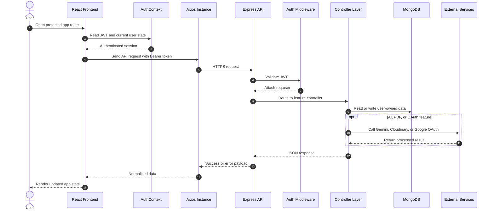
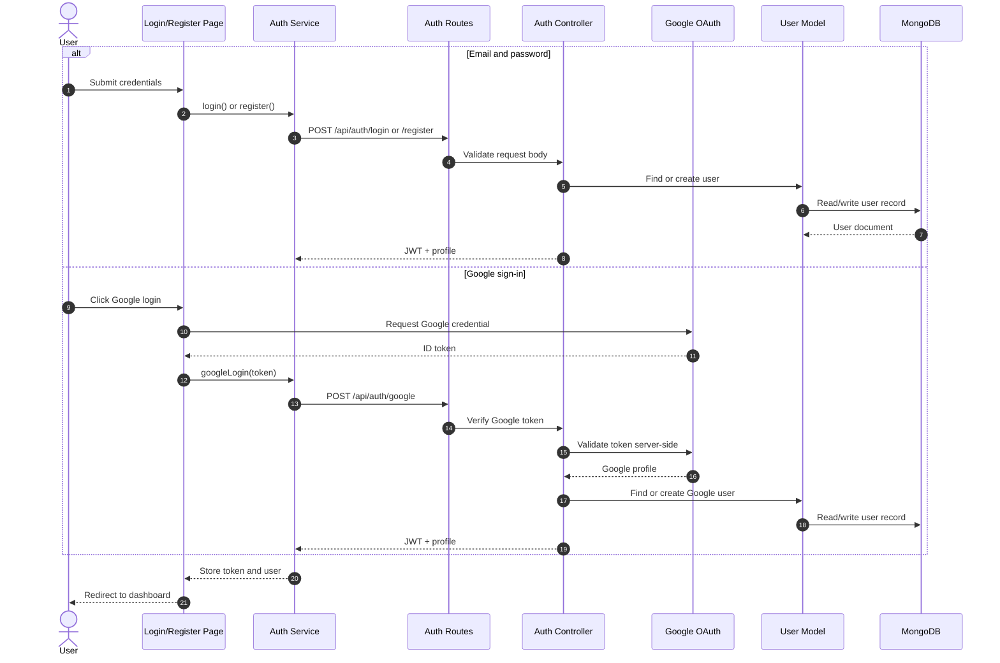
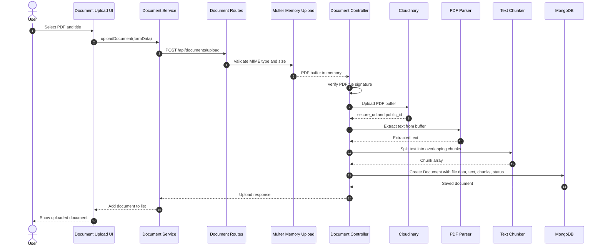
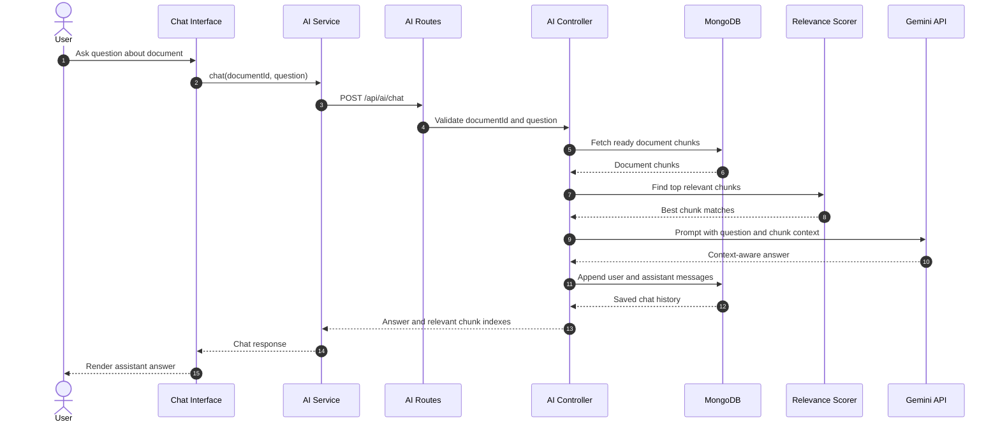
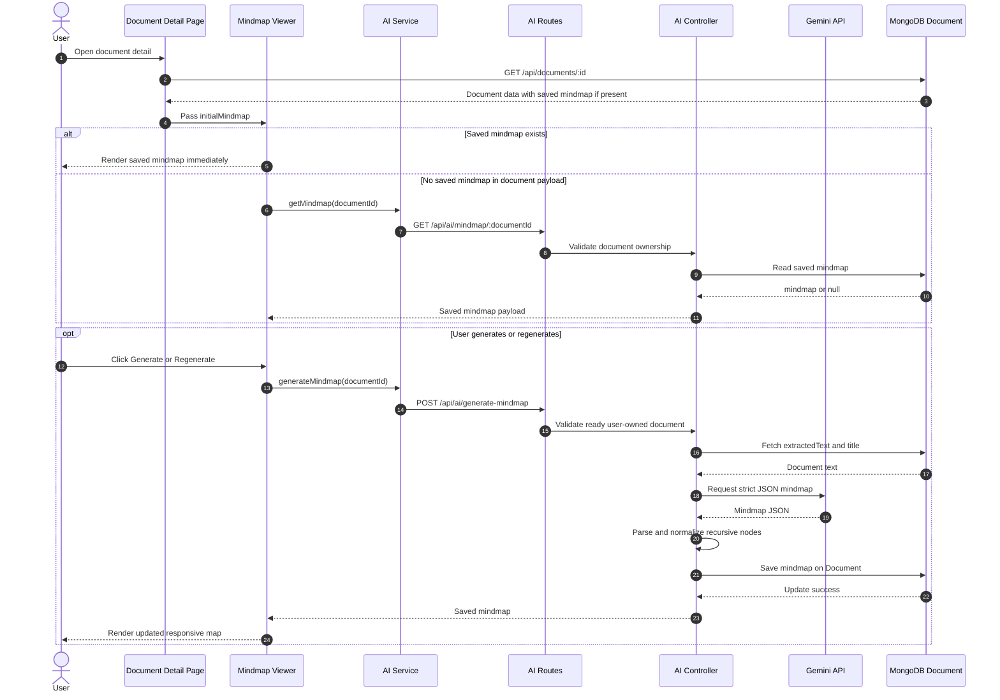
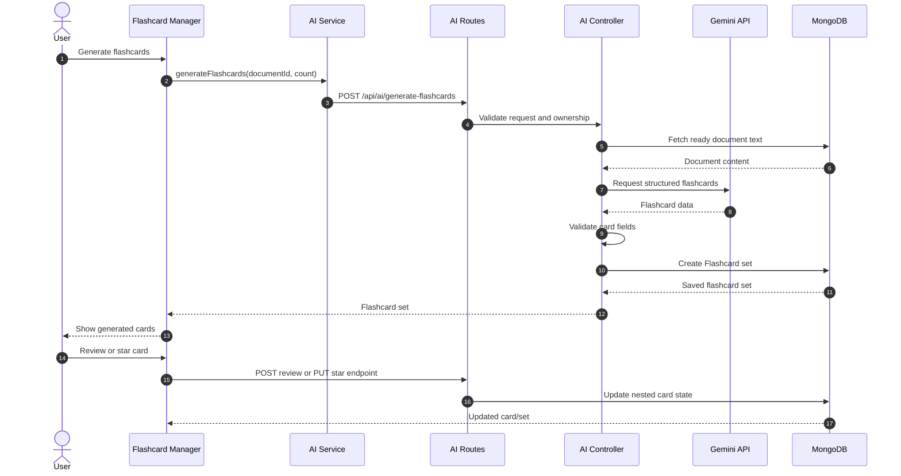
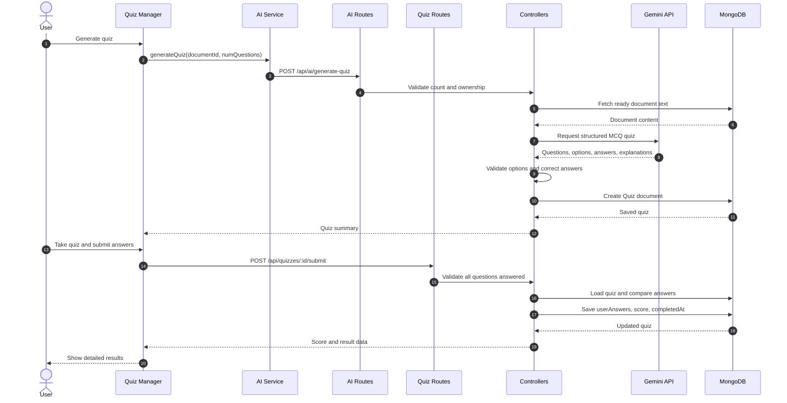
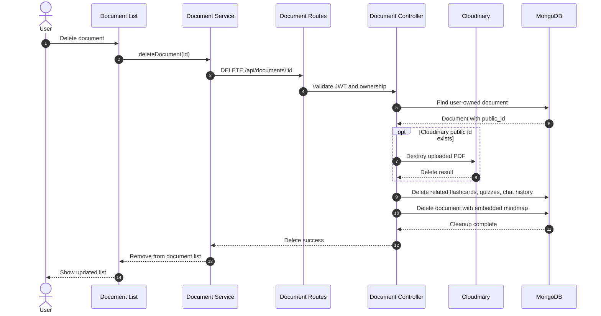
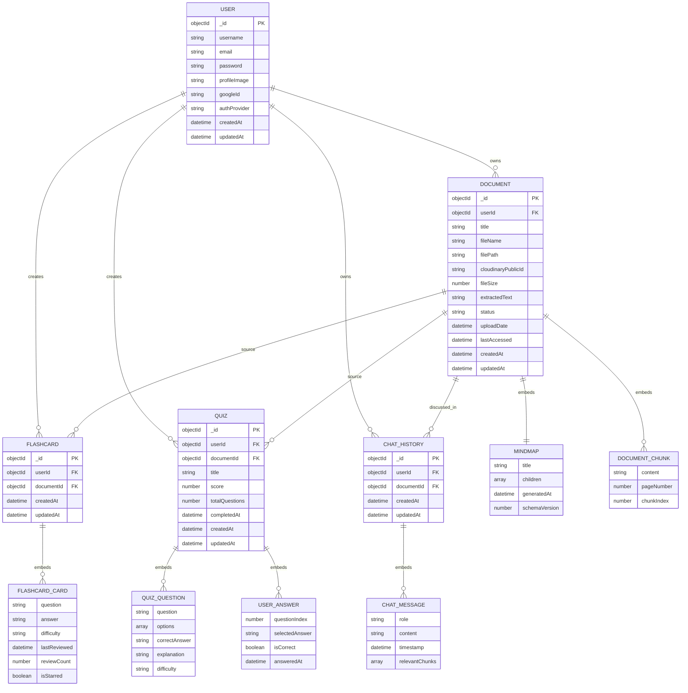

<p align="center">
  
</p>

<h1 align="center">📚 StudyFlow — AI-Powered Document Learning Assistance</h1>

<p align="center">
  <strong>Upload PDFs. Generate Mindmaps, Flashcards & Quizzes. Chat with AI. Track Progress.</strong><br/>
  A full-stack MERN application powered by Google Gemini AI that transforms static PDF documents into interactive, intelligent learning experiences.
</p>

<p align="center">
  
  
  
  
  
  
  
  
</p>

---

## 🌐 Live Demo - https://studyflow-ai-alpha.vercel.app/
---

## ✨ Features

### 📄 Document Management
- **PDF Upload** — Upload PDFs up to **10 MB**; files are stored on **Cloudinary CDN** (no local disk dependency)
- **Text Extraction** — Automatic text extraction from PDFs using `pdf-parse`
- **Smart Chunking** — Extracted text is split into overlapping word chunks (500 words, 50 word overlap) and stored in MongoDB for optimized AI context retrieval
- **Cloud Viewer** — One-click **"View PDF"** button opens the document from Cloudinary in a new browser tab (works on all devices and browsers — no iframe issues)
- **Production-safe Processing** — PDF extraction now completes before the upload response returns, avoiding unreliable after-response work in Vercel serverless functions
- **Upload Validation** — Client and server both validate file type and size; backend also checks the PDF file signature

### 🤖 AI Features (Google Gemini 2.5 Flash Lite)
- **Chat with Document** — Conversational AI that answers questions using relevant chunks from your uploaded PDFs
- **Generate Mindmap** — AI creates a structured, visual concept map from the document and saves it for future revisits
- **Generate Flashcards** — AI creates study flashcards from document content with difficulty levels
- **Generate Quiz** — Auto-generated multiple-choice quizzes with explanations
- **Document Summary** — Get a concise AI-generated summary of any uploaded document
- **Explain Concept** — Ask the AI to explain specific concepts found in the document
- **Safer AI Limits** — Server-side caps protect flashcard and quiz generation counts from accidental abuse
- **AI Output Validation** — Generated mindmaps, quiz answers, and flashcards are parsed/validated before being stored or shown

### 🧠 Mindmap System
- Generate one mindmap per ready document from the document detail page
- Saved directly inside the related MongoDB `Document` record
- Reopening a document automatically restores the saved mindmap
- Regenerate replaces the stored mindmap with the latest AI output
- Desktop view uses a scrollable canvas-style layout with measured SVG connector threads
- Mobile view uses a stacked responsive layout with no graph-library dependency
- Mindmap nodes are recursive text-only nodes: `title` plus `children`

### 🃏 Flashcard System
- Flip-card UI with question/answer reveal
- Star/favorite important cards
- Review tracking with last-reviewed timestamps
- Delete flashcard sets
- Multiple generated sets per document are supported

### 📝 Quizzes
- Multiple-choice questions with 4 options each
- Difficulty levels (Easy / Medium / Hard)
- Score calculation and detailed results with correct answers and explanations
- Review past quiz performance
- Frontend and backend prevent incomplete quiz submissions
- Backend validates submitted answers against the quiz options

### 📊 Progress Dashboard
- Total documents, flashcards, and quizzes count
- Recent study activity
- Quick navigation to study materials
- Deterministic study streak calculation based on recent activity instead of fake/random values

### 🔐 Authentication
- **Local** — Email/password registration and login with bcrypt hashing
- **Google OAuth** — One-click Google sign-in via `@react-oauth/google`
- JWT-based session management (7-day token expiry)
- Profile management and password change
- Minimum password length is 8 characters
- Google OAuth UI is hidden automatically if the frontend client ID is not configured

### 📱 Responsive Design
- Fully responsive layout with sidebar navigation on desktop and collapsible menu on mobile
- Works on all modern browsers (Chrome, Firefox, Safari, Edge) on both laptop and mobile
- Route-level code splitting keeps production chunks smaller and faster to load
- Lightweight markdown/code rendering removes the previous heavy syntax highlighter bundle

---

## ✅ Latest Production Hardening Changes

This version includes the following reliability, security, and deployment-readiness updates:

- Added a persisted AI mindmap feature with a recursive MongoDB schema embedded in `Document`.
- Added saved mindmap retrieval and regenerate-overwrite behavior.
- Added a responsive mindmap viewer with desktop canvas scrolling, mobile stacked layout, and measured SVG connector paths.
- Reworked document tabs for mobile-friendly wrapping without horizontal tab scrolling.
- Aligned app UI colors and component styling more closely with the landing page theme.
- Fixed chat prompt contrast so user messages stay readable.
- Reworked quiz generation prompt UI so the question-count card does not create oversized scrollable space.
- Removed repository credential notes and added stronger `.gitignore` rules for `.env`, `node_modules`, `dist`, logs, local Vercel files, and OS files.
- Added `backend/.env.example` and `frontend/.env.example`.
- Added backend required environment validation for production.
- Added MongoDB connection caching for serverless cold starts and repeated invocations.
- Added backend security headers.
- Added basic in-memory rate limiting for general API traffic, auth, uploads, and AI routes.
- Added request validation for auth, document, AI, flashcard, and quiz routes.
- Added explicit JSON and URL-encoded body size limits.
- Reordered quiz routes so `/api/quizzes/quiz/:id` cannot be shadowed by `/:documentId`.
- Reworked PDF upload processing to avoid Vercel after-response background execution.
- Added backend PDF signature validation.
- Added AI count caps and malformed AI output safeguards.
- Limited stored chat history growth to reduce MongoDB document growth risk.
- Added model-level length limits for documents, chat messages, quizzes, and users.
- Fixed dashboard fake streak logic and quiz timestamp mismatch.
- Split `useAuth` into a separate hook file for React Fast Refresh compatibility.
- Added `/terms` and `/privacy` pages.
- Added route-level lazy loading and split heavy document-tab components.
- Removed unused `react-syntax-highlighter` dependency and replaced it with lightweight code block rendering.
- Verified frontend lint, frontend production build, backend syntax checks, backend env validation, chunker behavior, rate limiter behavior, and production SPA route responses.

---

## 🏗️ Architecture

```
┌──────────────────────────────────────────────────────────────────┐
│                         FRONTEND (React 19)                      │
│   Vite 7 • TailwindCSS 4 • React Router v7 • Axios              │
│                                                                  │
│   ┌─────────┐ ┌──────────┐ ┌───────────┐ ┌──────────────────┐   │
│   │  Pages  │ │Components│ │  Services │ │ AuthContext (JWT) │   │
│   └────┬────┘ └────┬─────┘ └─────┬─────┘ └────────┬─────────┘   │
│        └───────────┴─────────────┴────────────────┘              │
│                         │  Axios HTTP                            │
│                         ▼                                        │
├──────────────────────────────────────────────────────────────────┤
│                       BACKEND (Express 5)                        │
│   Node.js • Mongoose 9 • JWT • Multer (memory) • Cloudinary     │
│                                                                  │
│   ┌────────┐ ┌────────────┐ ┌──────────┐ ┌─────────────────┐    │
│   │ Routes │→│ Controllers│→│  Models  │→│    MongoDB       │    │
│   └────────┘ └──────┬─────┘ └──────────┘ └─────────────────┘    │
│                     │                                            │
│          ┌──────────┼──────────────┐                             │
│          ▼          ▼              ▼                              │
│   ┌────────────┐ ┌──────────┐ ┌───────────────┐                 │
│   │ Cloudinary │ │ pdf-parse│ │ Google Gemini │                  │
│   │  (PDF CDN) │ │ (extract)│ │  (AI service) │                  │
│   └────────────┘ └──────────┘ └───────────────┘                 │
└──────────────────────────────────────────────────────────────────┘
```

### PDF Upload Flow

```
User uploads PDF
       │
       ▼
Multer (memoryStorage) ── validates PDF type & 10MB limit
       │
       ▼
Server verifies the file buffer starts with a PDF signature
       │
       ▼
Buffer ──► Cloudinary upload_stream (resource_type: "image")
       │         │
       │         └──► Returns secure_url + public_id
       │
       ▼
pdf-parse extracts text from the in-memory Buffer
       │
       ▼
textChunker splits text into overlapping chunks
       │
       ▼
MongoDB Document created with extractedText, chunks, and status: "Ready" or "Failed"
       │
       ▼
Response returned only after upload processing is complete
```

### AI Chat Flow

```
User sends message
       │
       ▼
Backend retrieves document chunks from MongoDB
       │
       ▼
findRelevantChunks() scores chunks by keyword overlap with user query
       │
       ▼
Top 3 relevant chunks injected into Gemini AI prompt
       │
       ▼
Gemini 2.5 Flash Lite generates context-aware response
       │
       ▼
Message + response saved to ChatHistory collection
       │
       ▼
Response returned to frontend
```

---

## 🔄 Project Flow Diagrams

The following Mermaid diagrams document the main production flows. They are GitHub-compatible and can be previewed directly in Markdown viewers that support Mermaid.

### Complete App Request Flow



### Authentication Flow



### PDF Upload And Processing Flow



### Document Chat Flow



### Saved Mindmap Flow



### Flashcard Generation And Review Flow



### Quiz Generation And Submission Flow



### Document Deletion Flow



## 🗃️ Database Schema Diagram



---

## 📁 Project Structure

```
StudyFlow_FullStack_Project_MERN/
│
├── backend/
│   ├── server.js                   # Express app entry point & Vercel export
│   ├── api/
│   │   └── index.js                # Vercel serverless function entry
│   ├── package.json
│   ├── .env.example                # Backend environment variable template
│   ├── vercel.json                 # Vercel serverless config (60s timeout)
│   │
│   ├── config/
│   │   ├── cloudinary.js           # Cloudinary v2 SDK configuration
│   │   ├── db.js                   # MongoDB / Mongoose connection
│   │   └── multer.js               # Multer memoryStorage + PDF filter + 10MB limit
│   │
│   ├── controllers/
│   │   ├── aiController.js         # AI endpoints (chat, mindmap, flashcards, quiz, summary, explain)
│   │   ├── authController.js       # Auth (register, login, Google OAuth, profile)
│   │   ├── documentController.js   # Document CRUD with Cloudinary upload/delete
│   │   ├── flashcardController.js  # Flashcard sets (CRUD, review, star)
│   │   ├── progressController.js   # Dashboard progress aggregation
│   │   └── quizController.js       # Quiz CRUD and submission scoring
│   │
│   ├── middlewares/
│   │   ├── auth.js                 # JWT verification middleware
│   │   ├── errorHandler.js         # Global error handler
│   │   ├── rateLimiter.js          # Lightweight API rate limiting
│   │   ├── securityHeaders.js      # Security response headers
│   │   └── validateRequest.js      # express-validator result handler
│   │
│   ├── models/
│   │   ├── ChatHistory.js          # AI chat conversation history
│   │   ├── Document.js             # PDF document with chunks, Cloudinary fields & saved mindmap
│   │   ├── Flashcard.js            # Flashcard sets with review tracking
│   │   ├── Quiz.js                 # Quizzes with questions & user answers
│   │   └── User.js                 # User with local & Google auth support
│   │
│   ├── routes/
│   │   ├── aiRoutes.js
│   │   ├── authRoutes.js
│   │   ├── documentRoutes.js
│   │   ├── flashcardRoutes.js
│   │   ├── progressRoutes.js
│   │   └── quizRoutes.js
│   │
│   └── utils/
│       ├── env.js                  # Required env validation
│       ├── geminiService.js        # Google Gemini AI integration with retry logic
│       ├── pdfParser.js            # PDF text extraction from Buffer (no disk I/O)
│       └── textChunker.js          # Text chunking with overlap + relevance scoring
│
├── frontend/
│   ├── index.html
│   ├── package.json
│   ├── .env.example                # Frontend environment variable template
│   ├── vite.config.js              # Vite + TailwindCSS plugin
│   ├── vercel.json                 # SPA rewrites for Vercel
│   │
│   └── src/
│       ├── App.jsx                 # Route definitions
│       ├── main.jsx                # Entry point + Google OAuth provider
│       ├── index.css               # Global styles + Tailwind imports
│       │
│       ├── components/
│       │   ├── ai/                 # AIActions (summary, explain)
│       │   ├── chat/               # ChatInterface (AI conversation UI)
│       │   ├── common/             # Button, EmptyState, MarkdownRenderer, Modal,
│       │   │                       #   PageHeader, Spinner, Tabs
│       │   ├── documents/          # DocumentCard
│       │   ├── flashcards/         # Flashcard, FlashcardManager, FlashcardSetCard
│       │   ├── homeComponents/     # Banner, Footer, LenisScroller, NavBar, SectionTitle
│       │   ├── homeSection/        # HeroSection, WhatWeDoSection, FreqSection, etc.
│       │   ├── layout/             # AppLayout (Header + Sidebar), Header, Sidebar
│       │   ├── mindmap/            # MindmapViewer with responsive saved mindmap UI
│       │   └── quizzes/            # QuizCard, QuizManager
│       │
│       ├── context/
│       │   ├── AuthContext.jsx     # Auth provider/state
│       │   └── useAuth.js          # Auth hook
│       │
│       ├── pages/
│       │   ├── Auth/               # LoginPage, RegisterPage, ProtectedRoute
│       │   ├── Dashboard/          # DashboardPage
│       │   ├── Documents/          # DocumentListPage, DocumentDetailPage
│       │   ├── Flashcards/         # FlashcardListPage, FlashcardPage
│       │   ├── Home/               # Home (landing page)
│       │   ├── Legal/              # TermsPage, PrivacyPage
│       │   ├── Profile/            # ProfilePage
│       │   ├── Quizzes/            # QuizTakePage, QuizResultPage
│       │   └── NotFoundPage.jsx
│       │
│       ├── services/               # API service modules (axios calls)
│       │   ├── aiService.js
│       │   ├── authService.js
│       │   ├── documentService.js
│       │   ├── flashcardService.js
│       │   ├── progressService.js
│       │   └── quizService.js
│       │
│       └── utils/
│           ├── apiPaths.js         # Centralized API URL builder
│           └── axiosInstance.js    # Axios instance with JWT interceptor
│
├── .gitignore
└── Readme.md
```

---

## 🔌 API Endpoints

### Authentication — `/api/auth`

| Method | Endpoint | Description | Auth |
|--------|----------|-------------|------|
| POST | `/register` | Register with email & password | No |
| POST | `/login` | Login with email & password | No |
| POST | `/google` | Google OAuth login/register | No |
| GET | `/profile` | Get current user profile | Yes |
| PUT | `/profile` | Update username & profile image | Yes |
| PUT | `/change-password` | Change password | Yes |

### Documents — `/api/documents`

| Method | Endpoint | Description | Auth |
|--------|----------|-------------|------|
| POST | `/upload` | Upload PDF (multipart form, max 10 MB) → Cloudinary | Yes |
| GET | `/` | List all user documents (with flashcard/quiz counts) | Yes |
| GET | `/:id` | Get single document detail (text, chunks, metadata, saved mindmap) | Yes |
| DELETE | `/:id` | Delete document + Cloudinary file + all associated data | Yes |

### AI — `/api/ai`

| Method | Endpoint | Description | Auth |
|--------|----------|-------------|------|
| POST | `/generate-flashcards` | Generate flashcards from document using Gemini AI | Yes |
| POST | `/generate-quiz` | Generate multiple-choice quiz from document | Yes |
| POST | `/generate-mindmap` | Generate and save a document mindmap | Yes |
| GET | `/mindmap/:documentId` | Retrieve the saved mindmap for a document | Yes |
| POST | `/generate-summary` | Generate document summary | Yes |
| POST | `/chat` | Chat with AI about a document (context-aware via chunks) | Yes |
| POST | `/explain-concept` | Explain a specific concept from document | Yes |
| GET | `/chat-history/:documentId` | Retrieve chat history for a document | Yes |

### Flashcards — `/api/flashcards`

| Method | Endpoint | Description | Auth |
|--------|----------|-------------|------|
| GET | `/` | Get all user's flashcard sets | Yes |
| GET | `/:documentId` | Get flashcards for a specific document | Yes |
| POST | `/:cardId/review` | Mark a flashcard as reviewed | Yes |
| PUT | `/:cardId/star` | Toggle star/favorite on a flashcard | Yes |
| DELETE | `/:cardId` | Delete a flashcard set | Yes |

### Quizzes — `/api/quizzes`

| Method | Endpoint | Description | Auth |
|--------|----------|-------------|------|
| GET | `/:documentId` | Get quizzes for a document | Yes |
| GET | `/quiz/:id` | Get a single quiz by ID | Yes |
| POST | `/:id/submit` | Submit quiz answers and get score | Yes |
| GET | `/:id/results` | Get quiz results with answers/explanations | Yes |
| DELETE | `/:id` | Delete a quiz | Yes |

### Progress — `/api/progress`

| Method | Endpoint | Description | Auth |
|--------|----------|-------------|------|
| GET | `/dashboard` | Get aggregated study progress data | Yes |

---

## 🗄️ Database Models

### User
| Field | Type | Notes |
|-------|------|-------|
| `username` | String | Required, unique, 3–50 chars |
| `email` | String | Required, unique, lowercase, regex validated |
| `password` | String | bcrypt hashed, required for local auth only |
| `profileImage` | String | Default avatar URL |
| `googleId` | String | Unique, sparse — for Google OAuth users |
| `authProvider` | String | `'local'` or `'google'` |
| `createdAt` / `updatedAt` | Date | Auto-managed timestamps |

### Document
| Field | Type | Notes |
|-------|------|-------|
| `userId` | ObjectId → User | Owner reference |
| `title` | String | User-provided document title |
| `fileName` | String | Original PDF filename |
| `filePath` | String | **Cloudinary `secure_url`** (HTTPS CDN link) |
| `cloudinaryPublicId` | String | Used for deletion from Cloudinary |
| `fileSize` | Number | File size in bytes |
| `extractedText` | String | Full extracted text from PDF |
| `chunks` | Array | `{ content, pageNumber, chunkIndex }` — used by AI context |
| `mindmap` | Object / null | Saved AI mindmap: `{ title, children, generatedAt, schemaVersion }` |
| `status` | Enum | `'Ready'` / `'Failed'`; `'Processing'` remains available for future async job support |
| `uploadDate` | Date | When the document was uploaded |
| `lastAccessed` | Date | When the document was last viewed |

#### Document Mindmap
| Field | Type | Notes |
|-------|------|-------|
| `title` | String | Mindmap root title |
| `children` | Array | Nested nodes: `{ title, children }` |
| `generatedAt` | Date | When the mindmap was generated |
| `schemaVersion` | Number | Mindmap schema version |


### Flashcard
| Field | Type | Notes |
|-------|------|-------|
| `userId` | ObjectId → User | Owner |
| `documentId` | ObjectId → Document | Source document |
| `cards` | Array | `{ question, answer, difficulty, lastReviewed, reviewCount, isStarred }` |

### Quiz
| Field | Type | Notes |
|-------|------|-------|
| `userId` | ObjectId → User | Owner |
| `documentId` | ObjectId → Document | Source document |
| `title` | String | AI-generated quiz title |
| `questions` | Array | `{ question, options[4], correctAnswer, explanation, difficulty }` |
| `userAnswers` | Array | `{ questionIndex, selectedAnswer, isCorrect, answeredAt }` |
| `score` | Number | Calculated after submission |
| `totalQuestions` | Number | Total question count |
| `completedAt` | Date | When the quiz was submitted (`null` if not taken) |

### ChatHistory
| Field | Type | Notes |
|-------|------|-------|
| `userId` | ObjectId → User | Owner |
| `documentId` | ObjectId → Document | Document being discussed |
| `messages` | Array | `{ role: 'user'/'assistant', content, timestamp, relevantChunks }` |

---

## 🛠️ Tech Stack

### Frontend
| Technology | Version | Purpose |
|-----------|---------|---------|
| React | 19.2 | UI framework |
| Vite | 7.3 | Build tool & dev server |
| TailwindCSS | 4.2 | Utility-first styling |
| React Router | 7.13 | Client-side routing (SPA) |
| Axios | — | HTTP client with JWT interceptor |
| react-hot-toast | — | Toast notifications |
| react-markdown + remark-gfm | — | Markdown rendering for AI responses |
| Lightweight code blocks | Built-in | Code rendering in AI markdown output without a heavy syntax-highlighting bundle |
| Lucide React | — | Modern icon library |
| Lenis | — | Smooth scroll (landing page) |
| @react-oauth/google | — | Google OAuth frontend integration |
| moment | — | Date/time formatting |
| tw-animate-css | — | TailwindCSS animations |

### Backend
| Technology | Version | Purpose |
|-----------|---------|---------|
| Node.js | 18+ | Runtime |
| Express | 5.2 | Web framework |
| Mongoose | 9.2 | MongoDB ODM |
| Cloudinary | 2.9 | PDF cloud storage & CDN delivery |
| Multer | 2.1 | File upload middleware (memory storage) |
| pdf-parse | 1.1.1 | PDF text extraction from buffer |
| @google/genai | 1.43 | Google Gemini AI SDK |
| bcryptjs | 3.0 | Password hashing |
| jsonwebtoken | 9.0 | JWT authentication |
| express-validator | 7.3 | Request input validation |
| google-auth-library | 10.6 | Google OAuth token verification |

### Infrastructure
| Service | Purpose |
|---------|---------|
| **MongoDB Atlas** | Cloud database |
| **Cloudinary** | PDF file storage & CDN delivery |
| **Vercel** | Serverless deployment (frontend + backend) |
| **Google Cloud** | OAuth 2.0 & Gemini AI API |

---

## ⚙️ Environment Variables

### Backend (`.env`)

```env
# Server
NODE_ENV=development
PORT=5000
FRONTEND_URL=http://localhost:5173

# Database
MONGODB_URI=mongodb+srv://<user>:<password>@cluster.mongodb.net/studyflow
# Optional DNS fallback for MongoDB Atlas SRV lookup
MONGODB_DNS_SERVERS=1.1.1.1,8.8.8.8
MONGODB_DNS_TIMEOUT_MS=5000
MONGODB_CONNECT_TIMEOUT_MS=12000

# JWT
JWT_SECRET=replace_with_a_random_secret_at_least_32_characters
JWT_EXPIRE=7d

# Google
GOOGLE_CLIENT_ID=your_google_client_id.apps.googleusercontent.com

# Gemini AI
GEMINI_API_KEY=your_google_gemini_api_key

# Cloudinary
CLOUDINARY_CLOUD_NAME=your_cloud_name
CLOUDINARY_API_KEY=your_cloudinary_api_key
CLOUDINARY_API_SECRET=your_cloudinary_api_secret

# Upload (optional — default is 10MB = 10485760 bytes)
MAX_FILE_SIZE=10485760
```

### Frontend (`.env`)

```env
VITE_API_URL=http://localhost:5000
VITE_GOOGLE_CLIENT_ID=your_google_client_id.apps.googleusercontent.com
```

---

## 🚀 Getting Started

### Prerequisites

- **Node.js** 18+ installed
- **MongoDB** database (local or [MongoDB Atlas](https://www.mongodb.com/atlas))
- **Cloudinary** account ([sign up free](https://cloudinary.com/))
- **Google Cloud** project with:
  - OAuth 2.0 Client ID ([Google Cloud Console](https://console.cloud.google.com/))
  - Gemini AI API key ([Google AI Studio](https://aistudio.google.com/))

### 1. Clone the Repository

```bash
git clone https://github.com/your-username/StudyFlow_FullStack_Project_MERN.git
cd StudyFlow_FullStack_Project_MERN
```

### 2. Setup Backend

```bash
cd backend
npm install
```

Create a `.env` file in the `backend/` directory with all variables from the **Backend Environment Variables** section above.

```bash
npm run dev    # Start with nodemon (development)
# or
npm start      # Start with node (production)
```

The backend server runs on **http://localhost:5000** by default.

### 3. Setup Frontend

```bash
cd frontend
npm install
```

Create a `.env` file in the `frontend/` directory:

```env
VITE_API_URL=http://localhost:5000
VITE_GOOGLE_CLIENT_ID=your_google_client_id.apps.googleusercontent.com
```

```bash
npm run dev    # Start Vite dev server
```

The frontend runs on **http://localhost:5173** by default.

### 4. Cloudinary Setup

1. Create a free [Cloudinary account](https://cloudinary.com/)
2. From the **Cloudinary Dashboard**, copy your **Cloud Name**, **API Key**, and **API Secret**
3. Add them to your backend `.env` file
4. When you upload PDFs, they will be stored in the `studyflow/documents/` folder in your Cloudinary Media Library

---

## ✅ Production Safety Checklist

Run these checks before promoting either app to production:

```bash
cd frontend
npm run lint
npm run build

cd ../backend
node --check server.js
```

Also verify the deployed preview can register/login, upload a PDF, open a document, generate a saved mindmap, refresh and reload the saved mindmap, regenerate the mindmap, generate a summary, generate flashcards, generate a quiz, submit a quiz, view results, and delete a document.


## 🌍 Deployment (Vercel)

Both the frontend and backend are configured for **Vercel** serverless deployment with zero-config.

### Backend Deployment

1. Push the `backend/` folder to a GitHub repository
2. Import in **Vercel** → set **Root Directory** to `backend`
3. Set all **Environment Variables** from the backend `.env` section
4. Set **Framework Preset** to **Other**
5. The `vercel.json` routes all requests to `api/index.js` with a **60-second function timeout**

### Frontend Deployment

1. Push the `frontend/` folder to a GitHub repository
2. Import in **Vercel** → set **Root Directory** to `frontend`
3. Set **Environment Variables**:
   - `VITE_API_URL` = your deployed backend URL (e.g., `https://studyflow-api.vercel.app`)
   - `VITE_GOOGLE_CLIENT_ID` = your Google Client ID
4. Set **Framework Preset** to **Vite**
5. The `vercel.json` handles SPA fallback routing for all client-side routes


## 🔒 Security

- Passwords hashed with **bcryptjs** (10 salt rounds)
- JWT tokens stored in `localStorage` with 7-day expiration. Treat this as an XSS-sensitive design; future production hardening should consider secure httpOnly cookies
- All API routes (except auth) protected by JWT verification middleware
- CORS configured to only allow the specified frontend origin and `*.vercel.app` preview deployments
- File uploads restricted to **PDF only** with configurable size limits and server-side PDF signature validation
- MongoDB injection prevented by Mongoose schema validation and type casting
- Input validation on auth, document, AI, flashcard, and quiz routes via `express-validator`
- Basic in-memory rate limiting protects auth, upload, AI, and general API routes
- Security headers are applied by backend middleware
- Required production environment variables are validated at startup
- Cloudinary files stored with unique timestamped public IDs
- Google OAuth tokens verified server-side via `google-auth-library`

---

## 📱 Frontend Routes

| Path | Page | Description |
|------|------|-------------|
| `/` | Home | Landing page with hero, features, testimonials |
| `/login` | Login | Email/password or Google OAuth login |
| `/register` | Register | New account registration |
| `/terms` | Terms | Terms of Service |
| `/privacy` | Privacy | Privacy Policy |
| `/dashboard` | Dashboard | Study progress overview _(protected)_ |
| `/documents` | Document List | View, upload & manage documents _(protected)_ |
| `/documents/:id` | Document Detail | View PDF, Chat, AI Actions, Mindmap, Flashcards, Quizzes tabs _(protected)_ |
| `/flashcards` | Flashcard List | Browse all flashcard sets _(protected)_ |
| `/documents/:id/flashcards` | Flashcard Study | Study flashcards for a specific document _(protected)_ |
| `/quizzes/:quizId` | Quiz Take | Take a quiz _(protected)_ |
| `/quizzes/:quizId/results` | Quiz Results | View quiz score, answers & explanations _(protected)_ |
| `/profile` | Profile | Manage account settings _(protected)_ |
| `*` | 404 | Not found page |

---

## 🧪 Feature Coverage Matrix

| Area | Covered Features | Main Files |
|------|------------------|------------|
| Auth | Register, login, Google OAuth, profile, password change, logout | `backend/controllers/authController.js`, `frontend/src/pages/Auth/*`, `frontend/src/context/*` |
| Documents | Upload, validate, extract text, chunk text, view, delete with related data cleanup | `backend/controllers/documentController.js`, `frontend/src/pages/Documents/*` |
| AI | Summary, explain concept, document chat, mindmap generation, flashcard generation, quiz generation | `backend/controllers/aiController.js`, `backend/utils/geminiService.js`, `frontend/src/components/ai`, `frontend/src/components/chat`, `frontend/src/components/mindmap` |
| Mindmaps | Generate, save to document, load on revisit, regenerate/update, responsive desktop/mobile display | `backend/models/Document.js`, `backend/controllers/aiController.js`, `frontend/src/components/mindmap/MindmapViewer.jsx` |
| Flashcards | List sets, generate, study, review, star, delete | `backend/controllers/flashcardController.js`, `frontend/src/components/flashcards`, `frontend/src/pages/Flashcards` |
| Quizzes | List, generate, take, validate full answers, submit, results, delete | `backend/controllers/quizController.js`, `frontend/src/components/quizzes`, `frontend/src/pages/Quizzes` |
| Dashboard | Counts, recent activity, average score, deterministic activity streak | `backend/controllers/progressController.js`, `frontend/src/pages/Dashboard/DashboardPage.jsx` |
| Production Safety | Env validation, CORS, rate limits, body limits, security headers, SPA rewrites | `backend/server.js`, `backend/middlewares/*`, `frontend/vercel.json`, `backend/vercel.json` |

---

## 🧠 How AI Features Work

1. **Context Retrieval** — Chat and concept explanation retrieve the most relevant text chunks from the document using keyword-based scoring (`textChunker.findRelevantChunks`)

2. **Generation Context** — Mindmap, flashcard, quiz, and summary generation use the extracted document text with server-side length limits before calling Gemini

3. **Prompt Engineering** — Document context is injected into carefully crafted prompts sent to the Google Gemini model

4. **Retry Logic** — The Gemini service includes exponential backoff with up to 3 retries for transient API failures

5. **Chat History** — Conversations are persisted in MongoDB with relevant chunk indices, allowing multi-turn context-aware discussions

6. **Structured Output** — AI responses for mindmaps, flashcards, and quizzes are generated in structured formats, parsed and validated before saving to MongoDB

7. **Saved Mindmaps** — Generated mindmaps are stored inside the source `Document`, loaded automatically on revisit, and overwritten when the user regenerates

8. **Server-side Limits** — AI endpoints validate counts and input lengths before calling Gemini

9. **Chat History Cap** — Chat history is capped to reduce MongoDB document growth risk

---

## 📋 Scripts

### Backend

| Script | Command | Description |
|--------|---------|-------------|
| `dev` | `nodemon server.js` | Development with hot reload |
| `start` | `node server.js` | Production start |

### Frontend

| Script | Command | Description |
|--------|---------|-------------|
| `dev` | `vite` | Development server with HMR |
| `build` | `vite build` | Production build |
| `preview` | `vite preview` | Preview production build locally |
| `lint` | `eslint .` | Lint codebase |

---

## 🤝 Contributing

1. Fork the repository
2. Create a feature branch (`git checkout -b feature/amazing-feature`)
3. Commit changes (`git commit -m 'Add amazing feature'`)
4. Push to branch (`git push origin feature/amazing-feature`)
5. Open a Pull Request

---

## 📄 License

This project is licensed under the **ISC License**.

---

