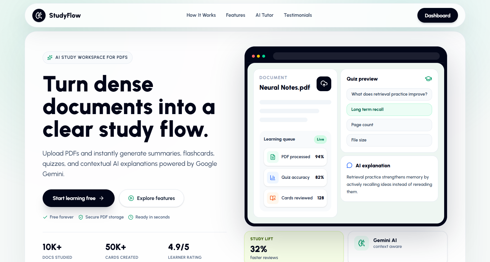

<p align="center">
  
</p>

<h1 align="center">📚 StudyFlow — AI-Powered Document & Workspace Learning Assistance</h1>

### 🌐 Live Demo — [https://studyflow-ai-alpha.vercel.app/](https://studyflow-ai-alpha.vercel.app/)

<p align="center">
  <strong>Single & Multi-Document Workspaces. AI Chat with Source Citation. Concept Mindmaps. Flashcards & Quizzes.</strong><br/>
  A full-stack MERN application powered by Google Gemini AI that transforms static PDF documents and multi-document folders into interactive, intelligent learning experiences.
</p>

<p align="center">
  
  
  
  
  
  
  
  
</p>



---

## 🌟 What's New & Key Highlights

- **📂 Multi-Document Workspaces & Folders:** Organize PDFs into themed folders with custom color tags. Conduct cross-document synthesis across multiple course PDFs or research papers simultaneously.
- **💬 Source-Attributed AI Chat:** Ask questions across an entire folder. AI responses tag specific source files (e.g. `[Source: "Cell_Biology_Ch4.pdf"]`).
- **🧠 Cross-Document Mindmaps:** Auto-generate interactive concept maps connecting themes across all PDFs in a workspace.
- **📤 Dual PDF Upload Workflows:** Add existing PDFs from your library OR upload external PDFs directly into workspaces with live progress tracking and Cloudinary signed uploads.
- **🔍 Document & Workspace Search:** Real-time keyword filtering across documents and folder collections.
- **🛡️ Cascading Cleanups & Validation:** Deleting a document or workspace cleanly purges Cloudinary files, text chunks, flashcard decks, quizzes, and chat histories in parallel.

---

## ✨ Full Feature Overview

### 📄 Document & Workspace Management
- **PDF Direct Upload** — Signed Cloudinary frontend uploads for PDFs up to 10MB with live reading, signing, uploading, and indexing progress bars.
- **Smart Chunking** — Automatic client-side PDF text extraction and backend semantic chunking (`500 tokens / 50 overlap`) with Tier-2 server fallback.
- **6-Tab Workspace Hub** — Dedicated navigation tabs for Documents, Multi-Doc AI Chat, Executive Summary, Concept Mindmap, Flashcards, and Quizzes.

### 🤖 AI Suite (Google Gemini 2.5)
- **Multi-Doc & Single-Doc Chat** — Conversational assistant with message history persistence and document source tagging.
- **Executive Summaries** — Generate concise summaries for single PDFs or multi-document folders.
- **Interactive Mindmaps** — Auto-generated concept trees rendered via React Flow with zoom, pan, and minimap controls.
- **Flashcards & Quizzes** — Auto-generate Q&A study decks and practice exams for single PDFs or entire workspaces. Universal set-based lookup (`/flashcards/set/:setId`).

### 📊 Progress & 🔐 Authentication
- **Analytics Dashboard** — Track study activity, quiz performance, and recently opened learning materials.
- **Auth System** — Secure JWT authentication and Google OAuth 2.0 integration.
- **Responsive Layout** — Tailored desktop and mobile views with centered UI tiles and backdrop-blur modals.

---

## 🏗️ Tech Stack

- **Frontend:** React 19, Vite, TailwindCSS 4, React Router v7, React Flow, `pdfjs-dist`, Axios, Lucide React.
- **Backend:** Node.js, Express 5, Mongoose 9, JWT, Cloudinary SDK, Express Rate Limit.
- **AI & DB:** Google Gemini AI SDK (`@google/genai`), MongoDB Atlas.

---

## 🚀 Getting Started

### Prerequisites
- Node.js 18+ and MongoDB Atlas Instance
- Cloudinary Account & Google Cloud Project (OAuth Client ID & Gemini API key)

### Setup Instructions

1. **Clone Repository**
   ```bash
   git clone https://github.com/iamalok123/studyflow-mern-fullstack.git
   cd studyflow-mern-fullstack
   ```

2. **Backend Setup**
   ```bash
   cd backend
   npm install
   npm run dev
   ```
   *Create a `.env` file in `backend/` with:*
   ```env
   PORT=5000
   MONGO_URI=your_mongodb_uri
   JWT_SECRET=your_jwt_secret
   GEMINI_API_KEY=your_gemini_api_key
   CLOUDINARY_CLOUD_NAME=your_cloudinary_name
   CLOUDINARY_API_KEY=your_cloudinary_api_key
   CLOUDINARY_API_SECRET=your_cloudinary_api_secret
   GOOGLE_CLIENT_ID=your_google_client_id
   FRONTEND_URL=http://localhost:5173
   ```

3. **Frontend Setup**
   ```bash
   cd ../frontend
   npm install
   npm run dev
   ```
   *Create a `.env` file in `frontend/` with:*
   ```env
   VITE_API_URL=http://localhost:5000/api
   VITE_GOOGLE_CLIENT_ID=your_google_client_id
   ```

---

## 🔌 Core API Endpoints

- **Auth:** `/api/auth/register`, `/api/auth/login`, `/api/auth/google`, `/api/auth/profile`
- **Documents:** `/api/documents/upload-signature`, `/api/documents/upload`, `/api/documents`, `/api/documents/:id`
- **Workspaces:** `/api/workspaces`, `/api/workspaces/:id`, `/api/workspaces/:id/documents`
- **AI Suite:** `/api/ai/chat`, `/api/ai/workspace-chat`, `/api/ai/generate-summary`, `/api/ai/workspace-summary`, `/api/ai/generate-mindmap`, `/api/ai/workspace-mindmap`, `/api/ai/generate-flashcards`, `/api/ai/generate-quiz`
- **Study & Progress:** `/api/flashcards/set/:setId`, `/api/quizzes/:id/submit`, `/api/progress/dashboard`

---

## 🗄️ Database Schema Summary
- **User:** Authentication, profiles, OAuth IDs.
- **Document:** Cloudinary URLs, extracted text, semantic chunks (`500/50`), status.
- **Workspace:** Folder metadata, document ID array, embedded summary & mindmap JSON.
- **Flashcard & Quiz:** Generated study resources linked to `documentId` or `workspaceId`.
- **ChatHistory:** Multi-turn conversation logs for documents or workspaces.

---

## 🌍 Vercel Production Deployment
Both `frontend/` and `backend/` contain pre-configured `vercel.json` rewrite settings:
- **Frontend SPA Rewrite:** `frontend/vercel.json` routes client routes to `/index.html`.
- **Backend API Serverless:** `backend/vercel.json` routes server requests to `/api/index.js`.

---

## 🤝 License
Licensed under the **ISC License**.
